# Projects

- [React](#react)
- [Scripts](#scripts)
- [Repositories](#repositories)
- [Games](#games)
- [Apps](#apps)
- [Tutorials](#tutorials)

---

## React

### **Tic-Tac-Toe**  
**React Tic-Tac-Toe implementation**  
**Tech:** `Html`, `Css`, `Javascript`, `JSX`  
[**Live Demo**](https://atari-monk.github.io/tic-tac-toe-react-tutorial-page/)  
[**Tutorial**](https://react.dev/learn/tutorial-tic-tac-toe)  

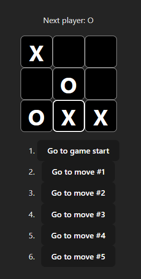  

### **Product Form**  
**React Product Form implementation**  
**Tech:** `Html`, `Css`, `Javascript`, `JSX`  
[**Live Demo**](https://atari-monk.github.io/product-form-react-tutorial-page/)  
[**Tutorial**](https://react.dev/learn/thinking-in-react)  

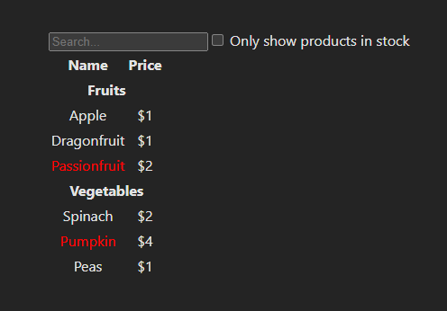  

## Scripts

### **Powershell Scripts**  
**A collection of Powershell Scripts**  
**Tech:** `Powershell`  
[**Repo**](https://github.com/atari-monk/powershell-scripts)  
[**Docs**](https://atari-monk.github.io/powershell-scripts/)  

## **Repositories**

### **Templates**  
**A collection of setups that stored for eventual reuse**  
**Tech:** `Config Files of Web, Python, ...`  
[**Repo**](https://github.com/atari-monk/templates)  
[**Docs**](https://atari-monk.github.io/templates/)  

## Games

### **battleship-ts**  
**Classic Battleship game in typescript**  
**Tech:** `Html`, `Css`, `Typescript`  
[**Repo**](https://github.com/atari-monk/battleship-ts)  
[**Live Demo**](https://atari-monk.github.io/battleship-ts/game/version_001/index.html)  

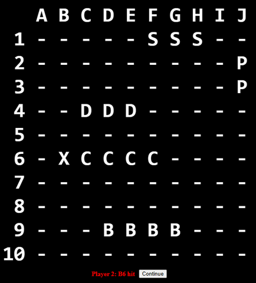  

### **memory-game**
**Memory game**  
**Tech:** `Html`, `Css`, `Javascript`  
[**Repo**](https://github.com/atari-monk/memory-game)  
[**Live Demo**](https://atari-monk.github.io/memory-game-1/)  

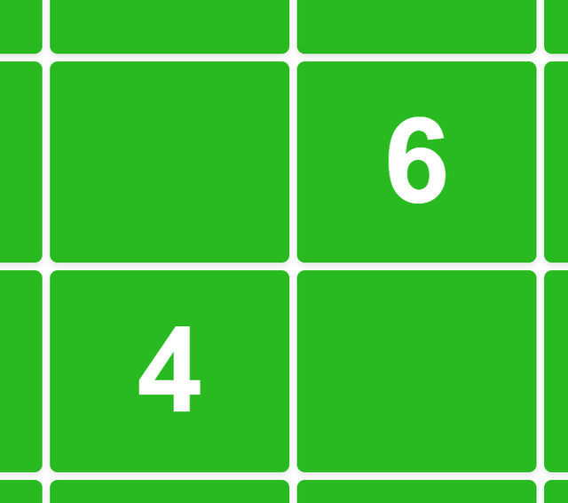  

### **football_engine**
**Game with a ball**  
**Tech:** `Html`, `Css`, `Typescript`, `Nx`  
[**Repo**](https://github.com/atari-monk/football_engine)  
[**Live Demo**](https://atari-monk.github.io/football_slideshow/)  

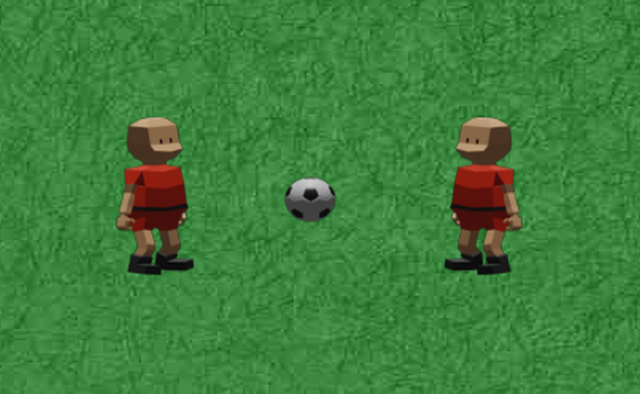  

### **ball-game-2.5**
**Client-server, 2 player ball game, mobile version**  
**Tech:** `Html`, `Css`, `Typescript`, `node.js`   
[**Repo**](https://github.com/atari-monk/ball_engine)  
[**Live Demo**](https://polite-bush-063bc3b03.3.azurestaticapps.net)  

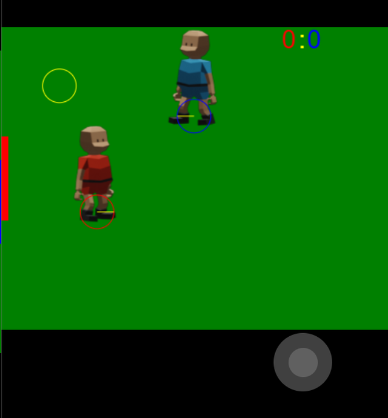  

### **ball-game-2**  
**Client-server, 2 player ball game**  
**Tech:** `Html`, `Css`, `Typescript`, `node.js`  
[**Repo**](https://github.com/atari-monk/ball-game-2)  
[**Live Demo**](https://atari-monk.itch.io/ball-game-2)  

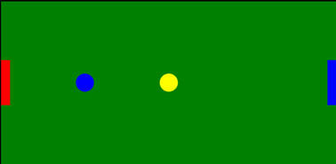  

### **ball-game**
**Client-server, 2 player ball game**    
**Tech:** `Html`, `Css`, `Typescript`  
[**Repo**](https://github.com/atari-monk/ball-game)  
[**Live Demo**](https://kind-moss-0f787ca03.3.azurestaticapps.net)  

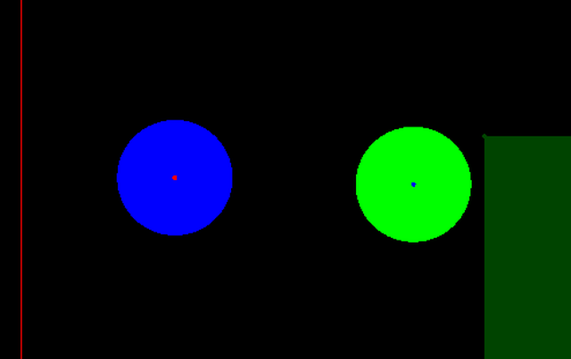  

### **js-pong**  
**Pong**  
**Tech:** `Html`, `Css`, `Typescript`  
[**Repo**](https://github.com/atari-monk/js-pong)  
[**Live Demo**](https://atari-monk.github.io/js-pong-page/pong.html)  
[**Tests**](https://atari-monk.github.io/js-pong-page/)  

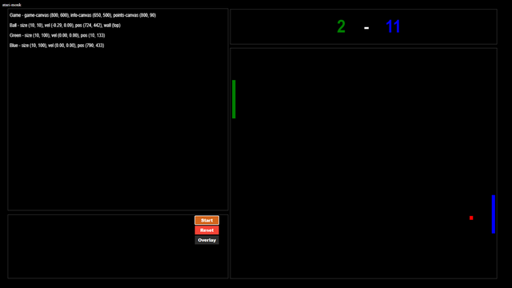  

## Apps

### **task_app**  
**Web Api and react app for task stuff with google login service**  
**Tech:** `Html`, `Css`, `TypeScript`, `MongoDb`, `React`  
[**Repo:**](https://github.com/atari-monk/task)  
[**Live Demo:**](https://red-beach-032340203.3.azurestaticapps.net/)  

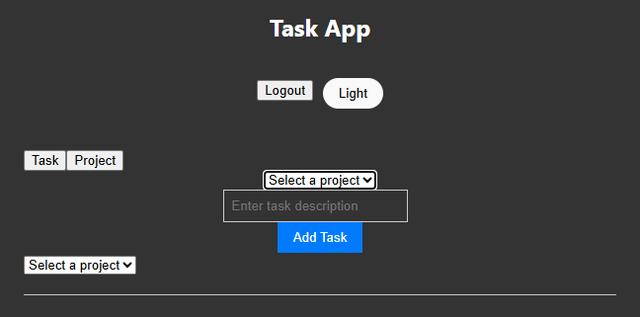  

### **wood_stock_app**  
**Simple react app, web api, mongodb**  
**Tech:** `Html`, `Css`, `TypeScript`, `MongoDb`, `React`  
[**Repo**](https://github.com/atari-monk/wood)  
[**Live Demo**](https://green-beach-088189603.3.azurestaticapps.net/)  

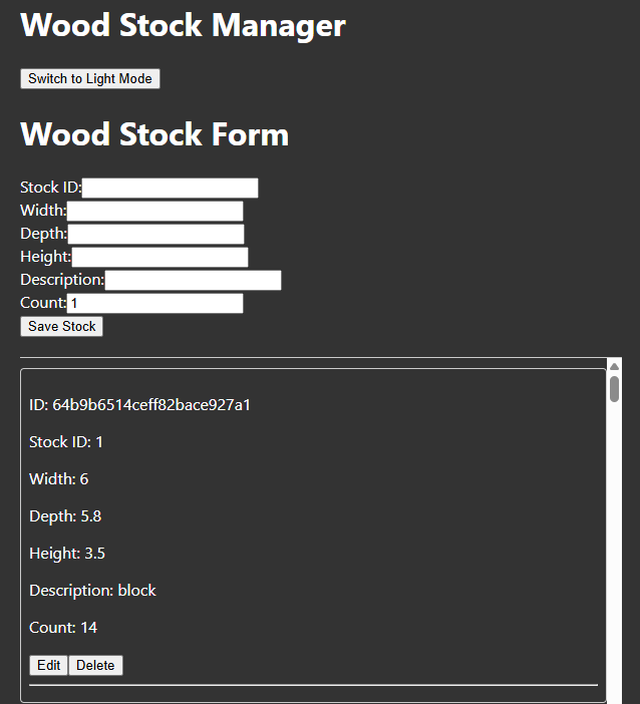  

### **socket_io_chat**  
**Server and clinet for simple chat**    
**Tech:** `Html`, `Css`, `TypeScript`  
[**Repo:**](https://github.com/atari-monk/socket-io-qs)  
[**Live Demo:**](https://atari-monk.github.io/samples/socket-io-client/client.html)  

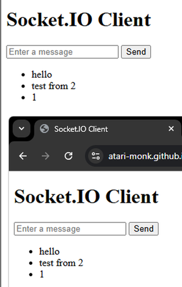  

## Tutorials  

### **3d_capsule**  
**3d platformer in Unity**  
**Tech:** `Unity`, `C#`  
[**Live Demo**](https://atari-monk.itch.io/3d-capsule)  

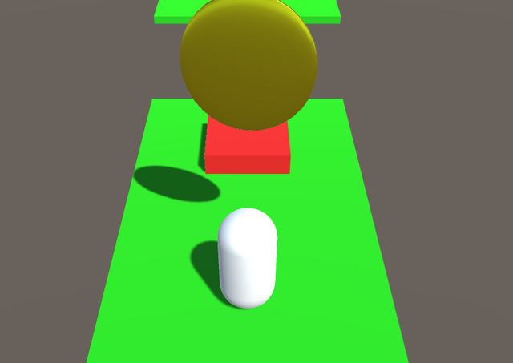  

### **best-game-ever**  
**2D platformer in Unity**  
**Tech:** `Unity`, `C#`
[**Live Demo**](https://atari-monk.itch.io/best-game-ever)   
[**Tutorial**](https://www.youtube.com/playlist?list=PLrnPJCHvNZuCVTz6lvhR81nnaf1a-b67U)  

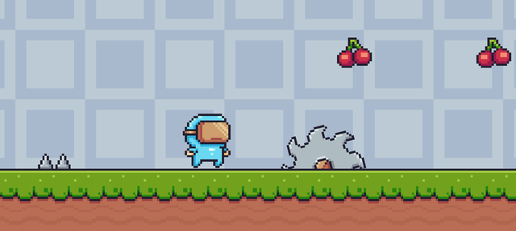  

### **pokemon**  
**2D game level**  
**Tech:** `Html`, `Css`, `Javascript`  
[**Repo:**](https://github.com/atari-monk/pokemon-tutorial)  
[**Live Demo:**](https://atari-monk.github.io/pokemon-tutorial/)  
[**Tutorial:**](https://www.youtube.com/watch?v=yP5DKzriqXA)  

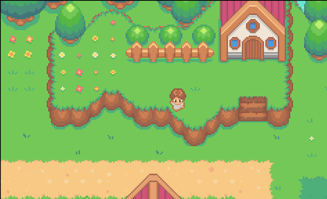  

### **2d sprites**  
**2D sprites**  
**Tech:** `Html`, `Css`, `Javascript`  
[**Repo:**](https://github.com/atari-monk/js-game-beginner)  
[**Live Demo:**](https://atari-monk.github.io/js-game-beginner/)  
[**Tutorial:**](https://www.youtube.com/watch?v=GFO_txvwK_c)  

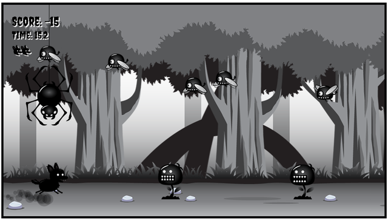  

### **arkanoid**  
**Classic small game idea**  
**Tech:** `Html`, `Css`, `Javascript`  
[**Live Demo:**](https://atari-monk.github.io/js-pong-page/arkanoid.html)  
[**Tutorial:**](https://compucademy.net/html5-breakout-game/?utm_content=cmp-true)  

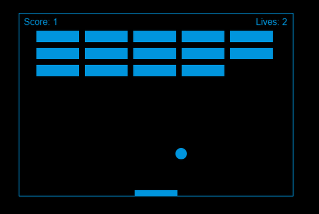  