# 🛠 Projects  

- [React](#react)
- [Games](#games)
- [Apps](#apps)
- [Tutorials](#tutorials)

## React

### 🎯 [Tic-Tac-Toe](#)  
**What it does:** React Tic-Tac-Toe implementation
**Tech used:** `Html`, `Css`, `Javascript`, `JSX`  
**Live Demo:** [Check it out](https://atari-monk.github.io/tic-tac-toe-react-tutorial-page/)  
**Tutorial:** [Tutorial](https://react.dev/learn/tutorial-tic-tac-toe)  

  

---

## Games

### 🎯 [battleship-ts](#)  
**What it does:** Classic Battleship game in typescript.  
**Tech used:** `Html`, `Css`, `Typescript`  
**Repo:** [GitHub Link](https://github.com/atari-monk/battleship-ts)  
**Live Demo:** [Check it out](https://atari-monk.github.io/battleship-ts/game/version_001/index.html)  

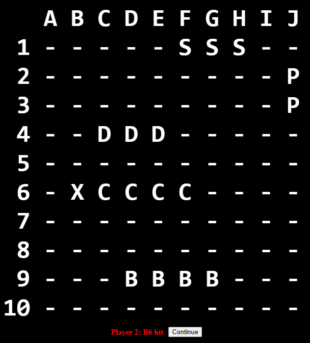  

---

### 🎯 [solar-system](#)  
**What it does:** Solar system simulation attempt.  
**Tech used:** `Html`, `Css`, `Typescript`  
**Repo:** [GitHub Link](https://github.com/atari-monk/solar-system)  
**Live Demo:** [Check it out](https://atari-monk.github.io/solar-system/client/index.html)  

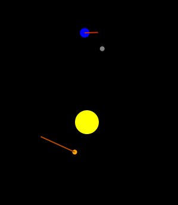  

---

### 🎯 [memory-game](#)  
**What it does:** Memory game.  
**Tech used:** `Html`, `Css`, `Javascript`  
**Repo:** [GitHub Link](https://github.com/atari-monk/memory-game)  
**Live Demo:** [Check it out](https://atari-monk.github.io/memory-game-1/)  

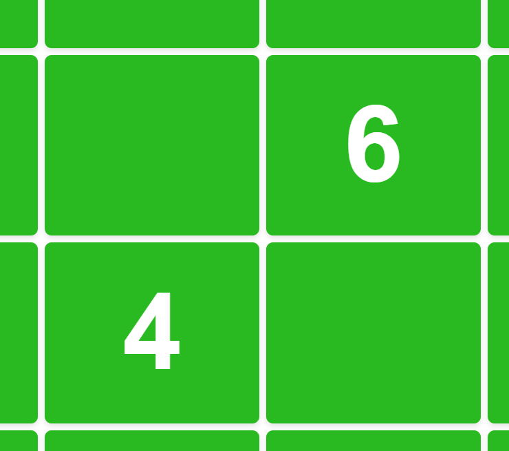  

---

### 🎯 [football_engine](#)  
**What it does:** Game with a ball.  
**Tech used:** `Html`, `Css`, `Typescript`, `Nx`  
**Repo:** [GitHub Link](https://github.com/atari-monk/football_engine)  
**Live Demo:** [Check it out](https://atari-monk.github.io/football_slideshow/)  

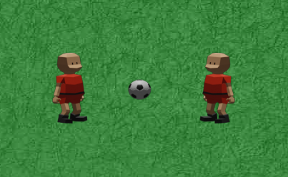  

---

### 🎯 [ball-game-2.5](#)  
**What it does:** Client-server, 2 player ball game.  
Mobile version.  
**Tech used:** `Html`, `Css`, `Typescript`, `node.js`   
**Repo:** [GitHub Link](https://github.com/atari-monk/ball_engine)  
**Live Demo:** [Check it out](https://polite-bush-063bc3b03.3.azurestaticapps.net)  

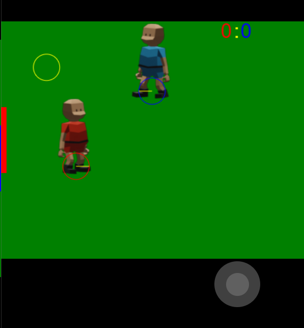  

---

### 🎯 [ball-game-2](#)  
**What it does:** Client-server, 2 player ball game.  
**Tech used:** `Html`, `Css`, `Typescript`, `node.js`  
**Repo:** [GitHub Link](https://github.com/atari-monk/ball-game-2)  
**Live Demo:** [Check it out](https://atari-monk.itch.io/ball-game-2)  

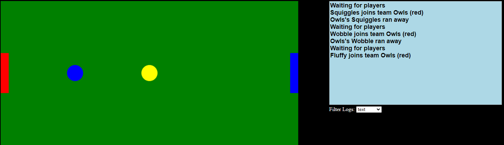  

---

### 🎯 [ball-game](#)  
**What it does:** Client-server, 2 player ball game.  
How not to do it.  
**Tech used:** `Html`, `Css`, `Typescript`  
**Repo:** [GitHub Link](https://github.com/atari-monk/ball-game)  
**Live Demo:** [Check it out](https://kind-moss-0f787ca03.3.azurestaticapps.net)  

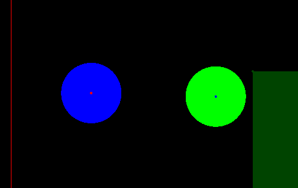  

---

### 🎯 [js-pong](#)  
**What it does:** Pong.  
**Tech used:** `Html`, `Css`, `Typescript`  
**Repo:** [GitHub Link](https://github.com/atari-monk/js-pong)  
**Live Demo:** [Check it out](https://atari-monk.github.io/js-pong-page/pong.html)  
**Tests:** [Tests](https://atari-monk.github.io/js-pong-page/)  

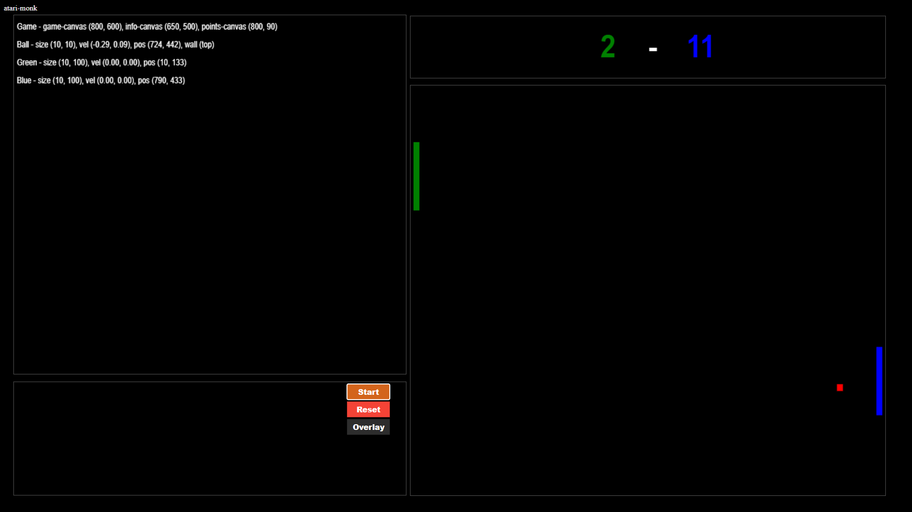  

---

## Apps

### 🎯 [task_app](#)  
**What it does:** Web Api and react app for task stuff.  
Goodle Login service.  
**Tech used:** `Html`, `Css`, `TypeScript`, `MongoDb`, `React`  
**Repo:** [GitHub Link](https://github.com/atari-monk/task)  
**Live Demo:** [Check it out](https://red-beach-032340203.3.azurestaticapps.net/)  

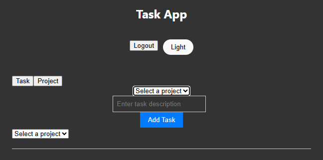  

---

### 🎯 [wood_stock_app](#)  
**What it does:** Simple react app, web api, mongodb.  
**Tech used:** `Html`, `Css`, `TypeScript`, `MongoDb`, `React`  
**Repo:** [GitHub Link](https://github.com/atari-monk/wood)  
**Live Demo:** [Check it out](https://green-beach-088189603.3.azurestaticapps.net/)  

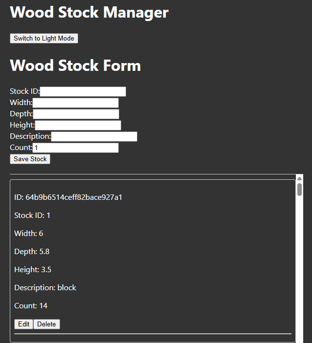  

---

### 🎯 [socket_io_chat](#)  
**What it does:** Server and clinet for simple chat.  
**Tech used:** `Html`, `Css`, `TypeScript`  
**Repo:** [GitHub Link](https://github.com/atari-monk/socket-io-qs)  
**Live Demo:** [Check it out](https://atari-monk.github.io/samples/socket-io-client/client.html)  

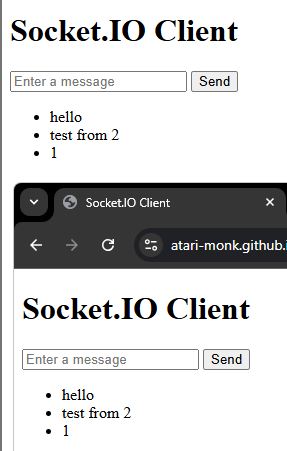  

---

## Tutorials  

### 🎯 [3d_capsule](#)  
**What it does:** 3d platformer in Unity.  
**Tech used:** `Unity`, `C#`  
**Live Demo:** [Check it out](https://atari-monk.itch.io/3d-capsule)  

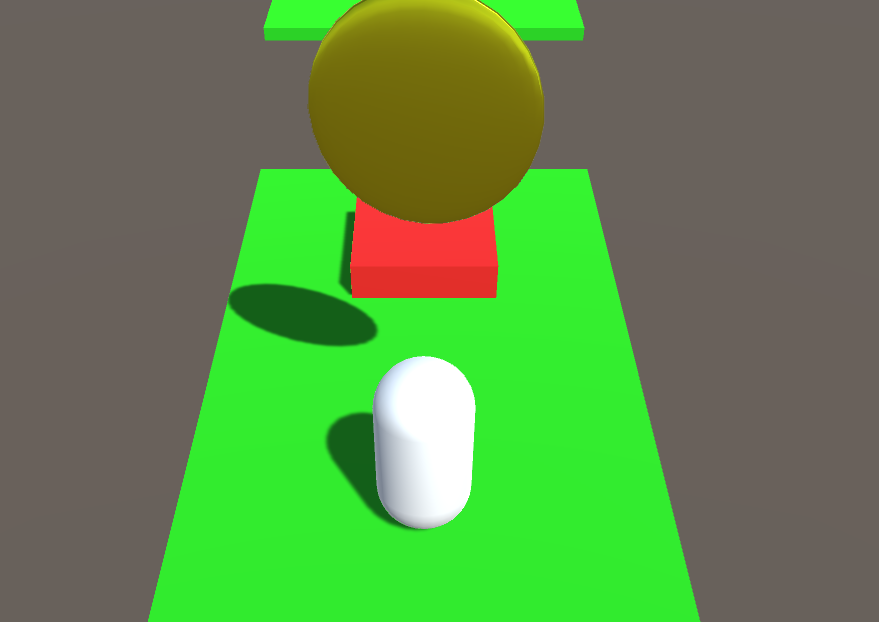  

---

### 🎯 [best-game-ever](#)  
**What it does:** 2D platformer in Unity.  
**Tech used:** `Unity`, `C#`  
**Live Demo:** [Check it out](https://atari-monk.itch.io/best-game-ever)   
**Tutorial:** [Tutorial](https://www.youtube.com/playlist?list=PLrnPJCHvNZuCVTz6lvhR81nnaf1a-b67U)  

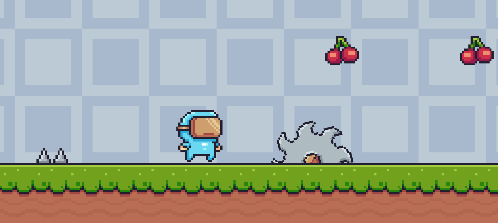  

---

### 🎯 [pokemon](#)  
**What it does:** 2D game level.  
**Tech used:** `Html`, `Css`, `Javascript`  
**Repo:** [GitHub Link](https://github.com/atari-monk/pokemon-tutorial)  
**Live Demo:** [Check it out](https://atari-monk.github.io/pokemon-tutorial/)  
**Tutorial:** [Tutorial](https://www.youtube.com/watch?v=yP5DKzriqXA)  

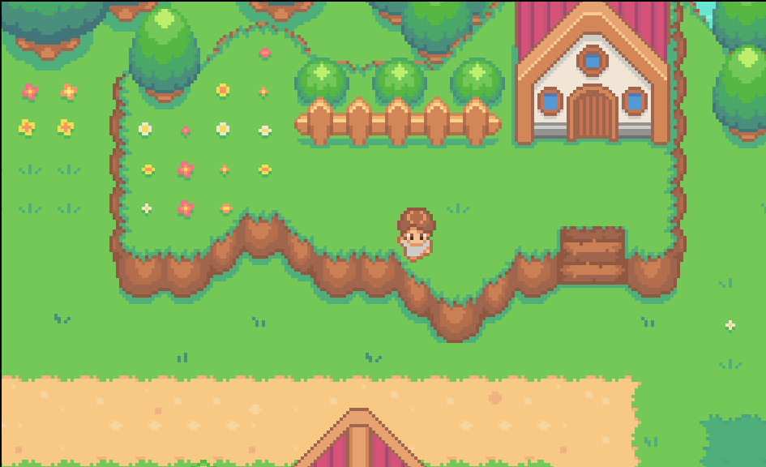  

---

### 🎯 [2d sprites](#)  
**What it does:** 2D sprites.  
**Tech used:** `Html`, `Css`, `Javascript`  
**Repo:** [GitHub Link](https://github.com/atari-monk/js-game-beginner)  
**Live Demo:** [Check it out](https://atari-monk.github.io/js-game-beginner/)  
**Tutorial:** [Tutorial](https://www.youtube.com/watch?v=GFO_txvwK_c)  

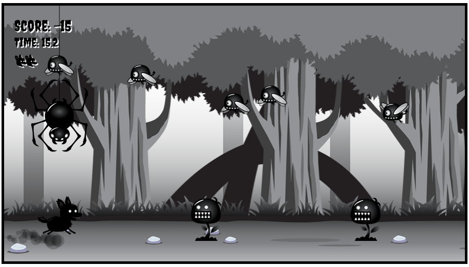  

---

### 🎯 [arkanoid](#)  
**What it does:** Classic small game idea.  
**Tech used:** `Html`, `Css`, `Javascript`  
**Live Demo:** [Check it out](https://atari-monk.github.io/js-pong-page/arkanoid.html)  
**Tutorial:** [Tutorial](https://compucademy.net/html5-breakout-game/?utm_content=cmp-true)  

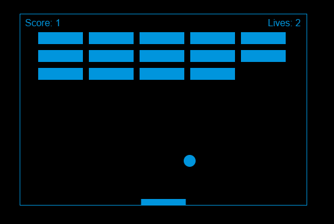  

---

